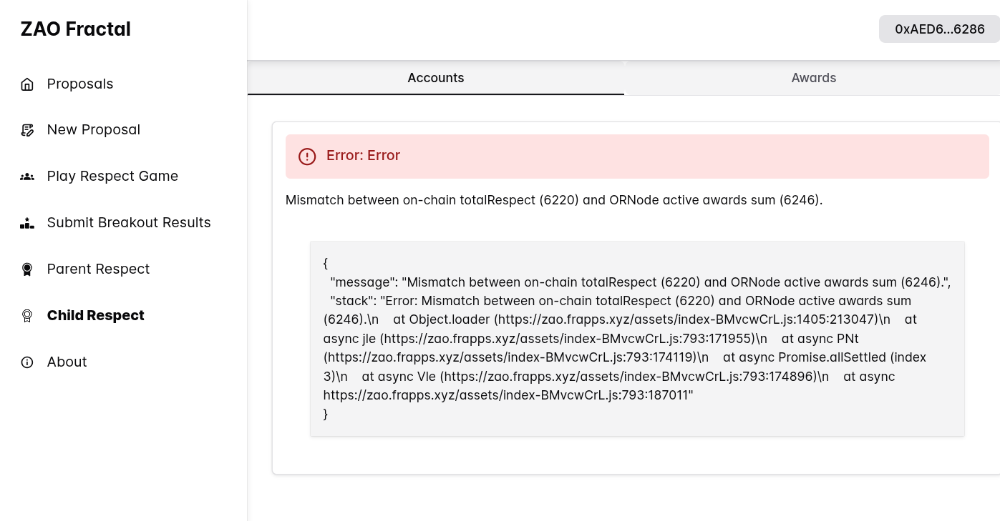
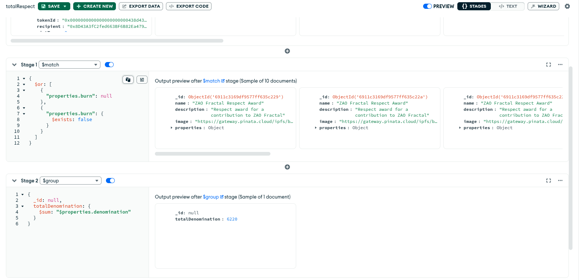
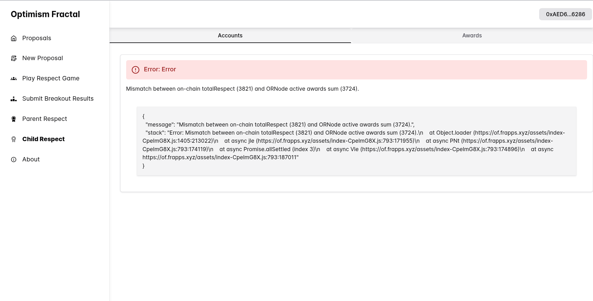

# Respect sum bug

Not sure how much these two cases are related.

These two different cases are from two different deployments of ordao.

## Case 1

I'm getting this error in https://zao.frapps.xyz:

 . 

I've ran aggregate query to calculate total respect from respect awards saved in ornode db and it returns the same value as onchain one:

## Case 2

I'm getting this error in https://of.frapps.xyz:

I've ran aggregate query to calculate total respect from respect awards saved in ornode db for this case too, but now it returns another value.

.

## Considerations
At first I noticed case 2 and thought that ornode simply missed some mint events, but not that I made these db queries and saw case 1 I'm not sure.

